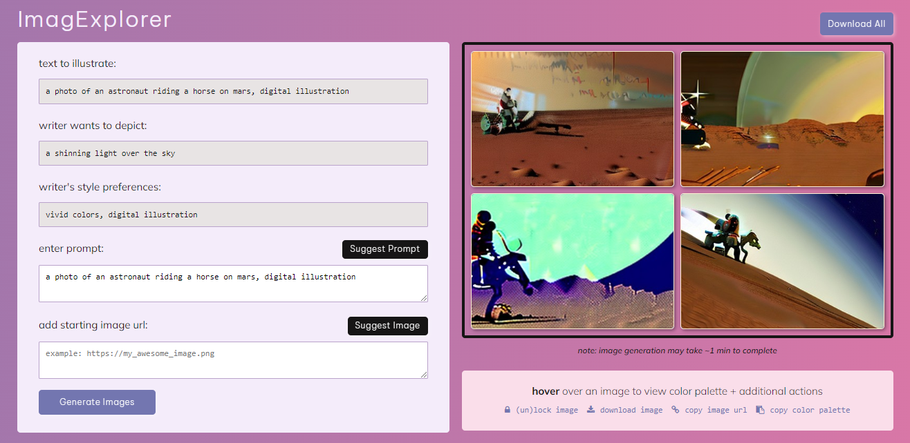

# Imago
Imago is a reference image brainstorming tool designed to facilitate communication between writers and artists. Powered by Stable Diffusion, a text-to-image AI model, Imago allows artists to view the original text and writer requests for illustrations while generating reference images. Additionally, Imago provides suggestions for prompts and starting images to feed into Stable Diffusion. The generated images are displayed on the right side of the interface, giving artists the opportunity to evaluate and adjust them according to their preferences. Artists can then perform actions such as downloading or sharing the images with the writer. Imago serves as an efficient tool for bridging the gap between writers and artists, enhancing collaboration and streamlining the creative process.

Made with:
* Stable Diffusion ([Replicate API](https://replicate.com/stability-ai/stable-diffusion/api))
* Flask

## overview


Imago is an innovative tool designed to help writers and artists communicate better and streamline the brainstorming process for creating reference images. This tool leverages the advanced capabilities of Stable Diffusion, a cutting-edge text-to-image AI model.

Artists are given the opportunity to view the original text and requests for illustrations from the writer, and can generate reference images by utilizing the tool's intuitive interface. ImagExplorer goes a step further and provides helpful suggestions for prompts and starting images, to help artists get started with generating images using Stable Diffusion.

The generated images are displayed in real-time on the right side of the screen, allowing artists to quickly and easily assess their results. If they are satisfied with what they see, they have the option to perform additional actions such as downloading or sharing the images with the writer.

With Imago, writers and artists can enjoy a seamless and efficient collaboration process, bridging the gap between imagination and creation.
## setup instructions
1. clone repo
```
git clone https://github.com/Diana-Barills/Imago
```

2. create virtual env
```
python3 -m venv env
```

3. activate env
```
source env/bin/activate
```

4. install requirements
```
pip3 install -r requirements.txt
```

5. set replicate API token env variable (grab token [here](https://replicate.com/account))
```
export REPLICATE_API_TOKEN=[your API key]
```

6. start app
```
python3 app.py
```
